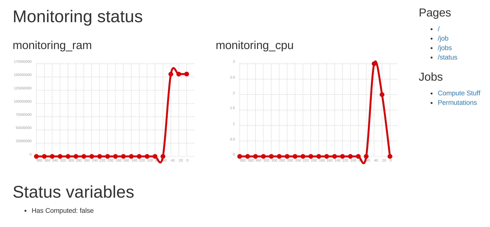
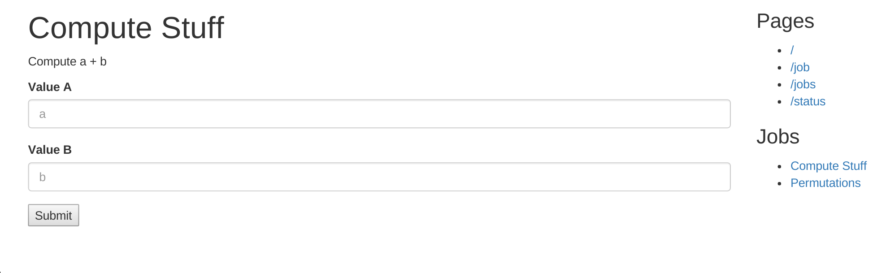
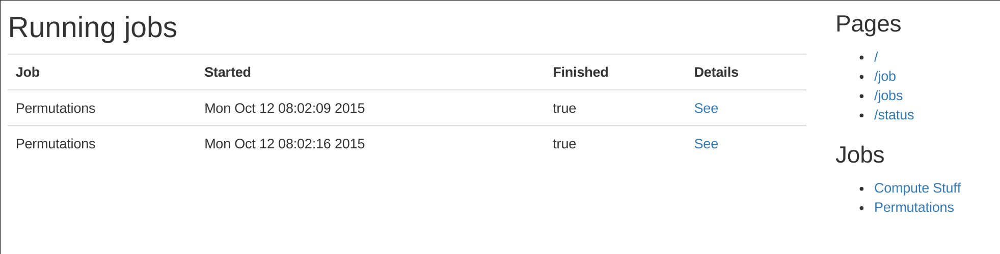

# Http-interface

Do you want to have a light, useful, and remotly accessible interface for your services?
Http-interfaces provides you a simple and clean way to quickly build a web UI. Declare few jobs,
use some logging functions, write a little of html-in-C++ code, and you're all set.

Want an example? look at the main.cpp file.

This word is heavily in progress and not intended to be stable, as it is in its prior states. If
you like it, contribute, it would be more than welcome. It would need a real buildsystem, cleaner
code, etc.

# Build

I know you love running your services in Docker. Who could blame you? Docker is awesome. so, just
build the Dockerfile, and you'll enjoy the demo sample.

# Screenshots

